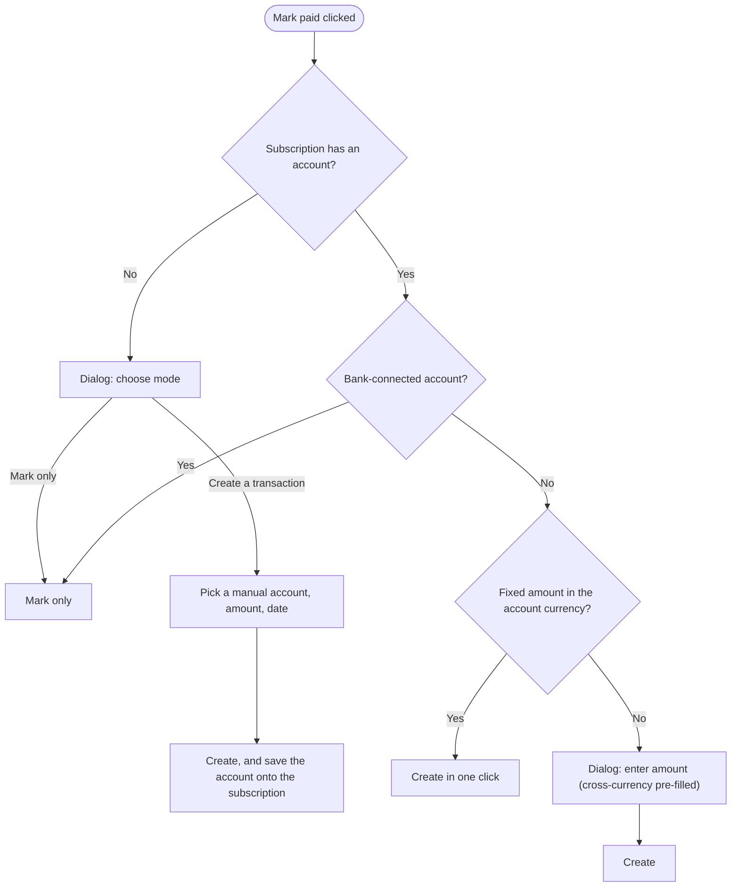
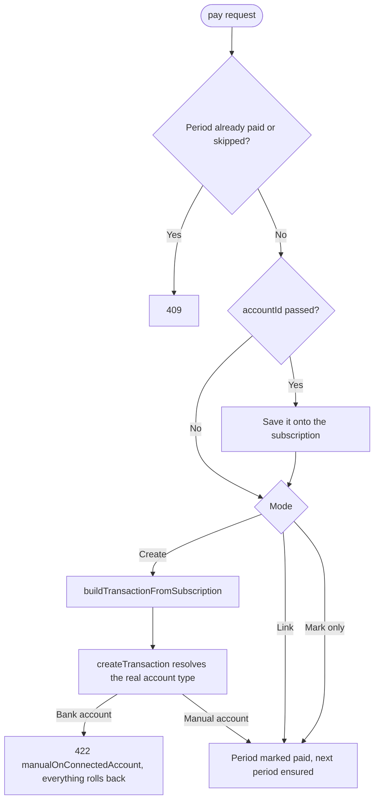
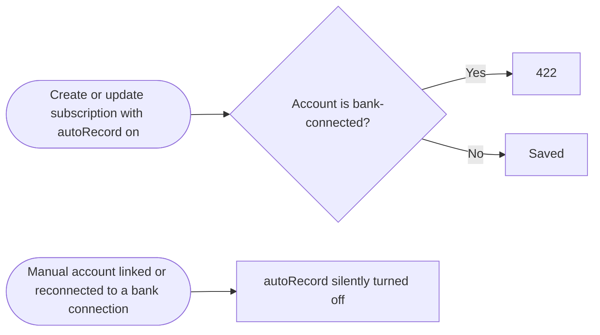

# Subscription Payment Flows

How a subscription period becomes "paid", and when that creates a transaction.

> **TL;DR**
> A subscription may book a transaction only on a **manual (`system`) account**. Bank-connected accounts get their transactions from the bank sync, so on those a period can only be marked paid (status only) or linked to a synced transaction.

---

## 1. Ways a period gets paid

| Mode            | What happens                                                       | Allowed on bank accounts   |
| --------------- | ------------------------------------------------------------------ | -------------------------- |
| **Mark only**   | Period → `paid`, no transaction.                                   | Yes                        |
| **Create**      | Builds a transaction from the subscription and links it.           | **No** (422)               |
| **Link**        | Links an existing transaction (manual or synced).                  | Yes                        |
| **Auto-record** | Hourly cron runs **Create** for every due period.                  | **No** (see §4)            |
| **Matching**    | Rules link incoming transactions (e.g. from bank sync) to periods. | Yes – the bank-account way |

Reverting a period deletes the transaction only if it was app-created (**Create** / **Auto-record**); linked transactions are left untouched. An app-created transaction whose account is bank-linked at revert time is also left in place, detached from the period.

---

## 2. "Mark paid" button (frontend)

`subscription-mark-paid-dialog.vue` → `triggerPay`

The account picker lists only manual accounts (`txTargetableSourceAccountsActiveFirst`), the same list as the Add Transaction dialog.

---

## 3. Backend enforcement

`POST /subscriptions/:id/periods/:periodId/pay` → `markPeriodPaid` (one DB transaction).

The builder deliberately omits `accountType`: passing one would skip `createTransaction`'s account-type check. That is how bank-account transactions slipped through before (#698).

---

## 4. Auto-record guards

Auto-record and bank accounts must never be combined, otherwise the cron fails on every tick.

| Where                                | Guard                                                                      |
| ------------------------------------ | -------------------------------------------------------------------------- |
| Edit-automation dialog               | Record mode offers only manual accounts; a saved bank account blocks Save. |
| Subscription create / update service | `assertAutoRecordAccountIsManual` → 422.                                   |
| `linkAccountToBankConnection`        | Sets `autoRecord = false` on the account's subscriptions.                  |
| `connectSelectedAccounts` (re-link)  | Sets `autoRecord = false` on the account's subscriptions.                  |
| Migration                            | One-off: turns off `autoRecord` on subscriptions already on bank accounts. |

After auto-record is turned off, the user keeps the **Mark paid** button (status only) and can set up **Matching** to link synced transactions automatically.
